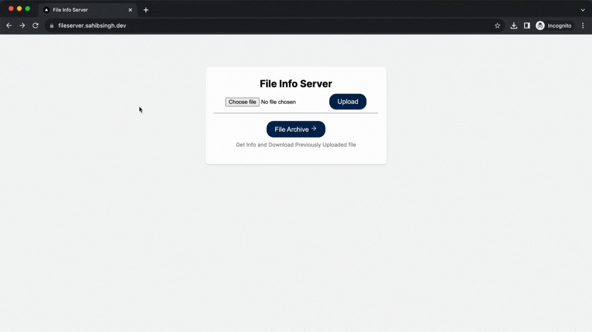

## Project Documentation: File Upload and Hosting Web Server - Rapid Fort

### Introduction

File Upload and Hosting Web Server project demonstrates the creation of a REST API-based web server that allows users to upload files, provides information about uploaded files, and hosts the files on a Kubernetes cluster.

### Table of Contents

- [Project Overview](#project-overview)
- [Getting Started](#getting-started)
- [API Endpoints](#api-endpoints)
- [User Interface](#user-interface)
- [Continuous Integration and Deployment](#continuous-integration-and-deployment)
- [Deploying to Kubernetes](#deploying-to-kubernetes)
- [Future Improvements](#future-improvements)
- [Conclusion](#conclusion)

### Project Overview

The project aims to create a web server that facilitates file uploading and hosting, providing users with an API to upload files, view file information, and access hosted files. The project comprises several key components:

- **Backend Server**: Built using Node.js and Express.js, the backend handles file uploads, metadata storage in MongoDB, and interactions with Azure Blob Storage for file hosting.

- **Frontend Interface**: A basic frontend interface is created to demonstrate file upload and file information retrieval via API requests.

- **Azure Blob Storage**: Files uploaded by users are stored in Azure Blob Storage, ensuring secure and scalable file hosting.

- **MongoDB**: Metadata about uploaded files, including filename, size, and content type, is stored in MongoDB.

- **Docker**: Docker images are built for the frontend and backend components to ensure consistency and ease of deployment.

- **Kubernetes**: Kubernetes manifest files define the deployment and service configurations for hosting the application on a Kubernetes cluster.

### Getting Started

To run the project locally, follow these steps:

1. Clone the GitHub repository:
    
   ```bash
   git clone https://github.com/ssahibsingh/rapidfort-file-server-api.git
    ```

2. Navigate to the `frontend` directory and run `npm install` to install frontend dependencies.

3. Navigate to the `backend` directory and run `npm install` to install backend dependencies.

4. Create an Azure Blob Storage account and obtain the connection string.

5. Set up a MongoDB instance and obtain the connection URI.

6. Create a `.env` file in the `backend` directory with the following environment variables:
   ```
   PORT=8000
   AZURE_STORAGE_CONNECTION_STRING=[Azure Blob Storage Connection String]
   MONGODB_URI=[MongoDB Connection URI]
   ```

7. Start the backend server: `npm start` in the `backend` directory.

8. Create a `.env.local` file in the `frontend` directory with the following environment variables:
   ```
   NEXT_PUBLIC_BACKEND_URL=`${backend-server-url}/api`
   ```

8. Start the frontend server: `npm start` in the `frontend` directory.

9. Access the application in your browser at `http://localhost:3000`.

### API Endpoints

The API provides the following endpoints:

- `POST /upload`: Uploads a file to Azure Blob Storage and stores metadata in MongoDB.
- `GET /file/:name`: Retrieves metadata for a specific file.
- `GET /download/:name`: Downloads the specified file.

### User Interface

The basic frontend interface allows users to:

- Upload a file.
- View metadata for a specific file.
- Download a file.



### Continuous Integration and Deployment

GitHub Actions is used for continuous integration and deployment. The following tasks are automated using GitHub Actions:

1. Building Docker images for the frontend and backend components.
2. Pushing Docker images to Docker Hub.
3. Deploying the application to an Azure VM's Kubernetes cluster.

### Deploying to Kubernetes

The application is deployed to a Kubernetes cluster using Kubernetes manifest files located in the `azure-deployment` directory. The deployment includes the frontend and backend components, along with appropriate service configurations.

To deploy:

1. Configure Kubernetes context using Azure credentials.
2. Ensure `kubectl` is installed.
3. Run the GitHub Actions workflow to deploy the application.

### Deployed Links
* **Frontend:**  https://fileserver.sahibsingh.dev
* **Backend:**  https://fileserver.sahibsingh.dev/api
### Conclusion

The "File Upload and Hosting Web Server" project demonstrates the creation of a REST API-based web server, leveraging Azure Blob Storage and MongoDB for file hosting and metadata storage. The integration of Docker and Kubernetes streamlines deployment, ensuring scalability and flexibility.